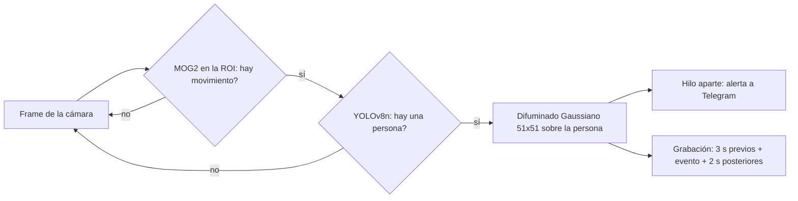
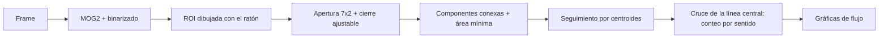

# Visión Artificial — Computer Vision Toolkit

> Colección de módulos de visión por computador desarrollados en Python: vigilancia con detección de personas, clasificación por múltiples métodos, calibración de cámara, medición sobre planos, análisis de tráfico, detector de objetos entrenado con dataset propio, realidad aumentada y sustitución de imágenes en tiempo real.


**English summary:** a set of computer vision projects built in Python with OpenCV, YOLO (Ultralytics) and MediaPipe. It covers real-time person detection with privacy-preserving alerts, a modular image classifier (SIFT, dense embeddings, Procrustes), camera calibration, homography-based measurement, traffic counting, a custom-trained YOLO detector (mAP50 0.995 on its validation set), marker-based augmented reality and real-time image replacement with optical-flow tracking. Each module below documents its method, results and limitations (documentation in Spanish).

---

## Qué demuestra este repositorio

- **Visión clásica y deep learning combinadas:** descriptores locales, geometría proyectiva y flujo óptico junto a redes de detección y embeddings.
- **Geometría de cámara:** calibración intrínseca, homografías, estimación de pose con `solvePnP` y medición métrica sobre planos, con márgenes de error calculados.
- **Sistemas en tiempo real:** hilos para no bloquear la captura, buffers circulares, detección en dos fases para ahorrar CPU y seguimiento de objetos.
- **Entrenamiento y evaluación de un detector propio:** dataset capturado y anotado a mano, imágenes de fondo como negativos y análisis de métricas.
- **Análisis crítico:** cada módulo recoge resultados medidos y las limitaciones que se han encontrado.

---

## Módulos

| Módulo | Descripción | Técnicas principales |
|---|---|---|
| [Detección de actividad](#detección-de-actividad) | Vigilancia inteligente con alertas Telegram | YOLOv8, MOG2, threading |
| [Clasificador modular](#clasificador-modular) | Reconocimiento de objetos por múltiples métodos | SIFT, embeddings, Procrustes |
| [Calibración de cámara](#calibración-de-cámara) | Medición 3D y corrección de distorsión | Matriz intrínseca, FOV, undistort |
| [Rectificación perspectiva](#rectificación-de-perspectiva) | Medición de distancias reales en imagen | Homografía, transformación métrica |
| [Análisis de tráfico](#análisis-de-tráfico) | Conteo de vehículos por sentido y gráficas de flujo | MOG2, morfología, componentes conexas, tracking |
| [Entrenamiento YOLO](#entrenamiento-yolo-personalizado) | Detector de objetos custom con dataset propio | Fine-tuning de YOLO11n, background images |
| [AR con marcadores](#ar-con-marcadores-en-l) | Realidad aumentada sobre un marcador en L | solvePnP, Rodrigues, pose estimation |
| [Sustitución en carnet](#sustitución-de-foto-en-carnet) | Reemplaza la foto de un carnet en tiempo real | ORB, RANSAC, Lucas-Kanade, alpha blending |

---

## Detección de actividad

**Archivo:** [`actividad/actividad_via.py`](actividad/actividad_via.py)

Sistema de vigilancia que detecta personas en una zona definida por el usuario, las anonimiza y envía una alerta a Telegram mientras guarda un vídeo del evento.



**Decisiones de diseño:**
- **Detección en dos fases:** MOG2 vigila solo la zona de interés y únicamente cuando detecta una masa de movimiento superior a un umbral se activa YOLOv8n (clase persona). Así la red no corre en cada fotograma.
- **Threading:** el envío a la API de Telegram tardaba entre 1 y 2 s y congelaba el vídeo, así que se delega en un hilo demonio.
- **Grabación con contexto:** una cola circular (`collections.deque`) guarda los últimos 3 s, de modo que el clip incluye cómo se acercó la persona; al terminar se graban 2 s más.
- **Una sola alerta por evento:** tras el primer aviso se bloquean los nuevos hasta que el vídeo se ha guardado, por lo que entrar y salir varias veces de la zona genera un único mensaje.
- **Privacidad por diseño:** se difumina (`GaussianBlur` 51×51) la caja que devuelve YOLO antes de enviar la imagen o escribir el vídeo, de modo que la persona nunca aparece sin anonimizar.
- ROI configurable interactivamente con el ratón.

**Resultados:** en pruebas de intrusión reales, el sistema reaccionó en cuanto la persona entró en la zona, envió un único mensaje por evento y generó vídeos anonimizados que incluyen los segundos previos a la entrada.

**Configuración del bot:**
```bash
# Crear actividad/token.env con tus propias credenciales
TOKEN = "tu_token_de_botfather"
USER_ID = "tu_chat_id"
```

---

## Clasificador modular

**Archivos:** [`clasificador/`](clasificador/)

Programa de reconocimiento de imágenes que compara cada fotograma de la cámara con un directorio de modelos de referencia. Los métodos se cargan dinámicamente a través de una interfaz común (IReconocedor, con las operaciones precompute y compare), de modo que añadir o sustituir un método solo requiere tocar un fichero. Las características de los modelos se calculan una sola vez al cargar la carpeta.

**Métodos disponibles:**

| Método | Archivo | Algoritmo | Umbral de rechazo | Mejor para |
|---|---|---|---|---|
| SIFT | [`metodos/SIFT.py`](clasificador/metodos/SIFT.py) | FLANN KD-tree + ratio test de Lowe (0.7); puntúa por nº de *good matches* | Menos de 60 coincidencias | Objetos planos con textura rica, cambios de escala/rotación |
| Embeddings | [`metodos/mediapipe_embedding.py`](clasificador/metodos/mediapipe_embedding.py) | MobileNetV3 (MediaPipe Image Embedder) + similitud coseno; d = 1 − ⟨e_actual, e_modelo⟩ | d > 0.4 | Escenas diferentes entre sí con misma cámara y fondo |
| Procrustes | [`metodos/procrustes.py`](clasificador/metodos/procrustes.py) | 21 landmarks de MediaPipe Hands (x, y) + disparidad de Procrustes (traslación, rotación y escala óptimas) | Disparidad > 0.10 | Reconocimiento de gestos de mano |

Procrustes detecta hasta dos manos pero rechaza el fotograma si aparece más de una, para evitar ambigüedades.

**Uso:**
```bash
python clasificador/main.py --modelos modelos/modelos-libros --metodos SIFT
python clasificador/main.py --modelos modelos/modelos-libros --metodos mediapipe_embedding
python clasificador/main.py --modelos modelos/modelos-gestos --metodos procrustes
```

**Resultados:** conjunto de prueba con tres versiones de una misma portada de libro (dos con la webcam y una con la cámara de un móvil, con fondos e iluminación distintos) y dos portadas distractoras.

| Método | Webcam, mismo fondo | Webcam, otro fondo | Foto del móvil | Distractores |
|---|---|---|---|---|
| Embeddings (confianza) | 85,2 % (d = 0.15) | 41,2 % | 34,9 % (d = 0.65, rechazada) | 23,9 % y 21,4 % |
| SIFT (coincidencias) | 359 | 205 | 165 | 7 y 0 |

- **Embeddings:** al ser un descriptor global, mezcla objeto, fondo, color y ruido del sensor; cambiar de cámara o de fondo degrada la propia clasificación (la foto del móvil queda a solo 11 puntos de los distractores).
- **SIFT:** reconoce las tres versiones, pero las capturas hechas con la misma cámara y entorno ganan por margen, porque los puntos del fondo también cuentan. Degrada el ranking, no la decisión.
- **Procrustes:** el menos afectado por el cambio de cámara, porque compara coordenadas de landmarks y no píxeles. Es sensible al ángulo desde el que se ve la mano (se usan puntos 2D).

---

## Calibración de cámara

**Archivos:** [`calibracion/`](calibracion/)

Herramienta de calibración intrínseca y medición 3D en escena.

- **Calibración** con 8 capturas de un tablero de ajedrez desde distintas perspectivas y distancias. Resultado para la webcam usada (640×480):
  - Matriz intrínseca K con f<sub>x</sub> = 840,32, f<sub>y</sub> = 832,56, c<sub>x</sub> = 330,34 y c<sub>y</sub> = 221,40.
  - Distorsión D = [0,378, −4,281, −0,004, 0,011, 16,068]; los coeficientes radiales indican distorsión de barril, que se corrige con `cv.undistort`.
- **Campo visual:** FOV = 2·arctan(resolución / 2f) → **41,69° horizontal y 32,16° vertical**.
- **Cuadrícula de medida:** superpone una cuadrícula 3D sobre un plano perpendicular al eje óptico a una distancia Z seleccionable con sliders (junto con FOV, altura de cámara y desplazamiento X), usando el modelo de cámara estenopeica y los parámetros K. Los resultados se contrastaron con medidas reales tomadas con cinta métrica.

**Archivos de calibración incluidos:**
- [`calibracion/calib.txt`](calibracion/calib.txt) — parámetros K, D de la cámara usada.
- [`calibracion/calibrate/pattern.png`](calibracion/calibrate/pattern.png) — patrón de tablero de ajedrez.
- [`calibracion/calibrate/capturas-stream/`](calibracion/calibrate/capturas-stream/) — 8 capturas de calibración.

---

## Rectificación de perspectiva

**Archivos:** [`rectificacion/`](rectificacion/)

Estima distancias reales entre puntos de un plano a partir de una homografía calculada con referencias de coordenadas conocidas. Se divide en dos scripts:

```bash
# 1. Marcar los puntos de referencia con el ratón (u: deshacer, r: reiniciar, q: terminar)
python seleccionar_puntos.py eder gol-eder.png      # modo campo de fútbol
python seleccionar_puntos.py folio imagen-folio.png # modo folio A4

# 2. Calcular la homografía, la distancia y la vista cenital rectificada
python rectificacion.py gol-eder.png
```

Genera la imagen original anotada con la distancia y su margen de error, y la vista cenital rectificada, que sirve para comprobar visualmente que la homografía es correcta.

**Caso 1: distancia de un disparo a portería.** Se toman como referencia cuatro puntos del área grande (dimensiones FIFA 16,5 × 40,32 m): tres esquinas y el punto de penalti, en lugar de la cuarta esquina, que queda fuera del encuadre y habría obligado a extrapolar.

**Caso 2: verificación con imágenes propias.** Un folio A4 (29,7 × 21,0 cm) como plano de referencia y dos objetos colocados encima.

| Escenario | Distancia calculada | Margen de error | Validación |
|---|---|---|---|
| Campo de fútbol | 24,33 m | ± 0,35 m | Coherente con la distancia estimada del disparo (~25 m) |
| Folio A4 | 16,18 cm | ± 0,09 cm | Regla: ≈ 16 cm |

**Margen de error:** se calcula perturbando 2 px los clics del punto objetivo y recalculando la distancia con la misma homografía. Este test cubre la sensibilidad al clic del punto medido, no un error al marcar las referencias, que se propagaría por toda la homografía. La precisión depende de cuánta superficie del encuadre ocupa el plano de referencia: los mismos 2 px son décimas de milímetro en el folio y decenas de centímetros en una panorámica de estadio.

---

## Análisis de tráfico

**Archivos:** [`trafico/`](trafico/)

Cuenta los vehículos que cruzan una línea central en un vídeo de carretera, los separa por sentido de movimiento (izquierda / derecha) y genera gráficas del flujo a lo largo del tiempo. Probado con un stream público de una carretera.



**Decisiones de diseño:**
- **Sin filtro Gaussiano previo:** se probó para reducir el ruido del sensor, pero difuminaba los coches pequeños y lejanos hasta hacerlos desaparecer. Se pasa la imagen nítida a MOG2 y el ruido se limpia después con morfología.
- **ROI interactivo**  para ignorar el agua y analizar solo la carretera.
- **Morfología en dos pasos:** una apertura con kernel vertical 7×2 para eliminar ruido fino y un cierre de tamaño ajustable que une los fragmentos de una misma carrocería.
- **Seguimiento con memoria:** cada detección se asocia al objeto libre más cercano dentro de una distancia máxima; un vehículo que desaparece un instante se recuerda durante 15 frames, para que al reaparecer recupere su ID y no se cuente dos veces.
- **Sliders integrados en la ventana** para ajustar en tiempo real el área mínima, el cierre morfológico y la distancia máxima de asociación.
- **Gráficas:** una gráfica en vivo por bloques de 100 frames y, al terminar, una figura con los vehículos por bloque y sentido y el flujo total frente a su media, guardada como `grafica_trafico.png`.

**Mejor configuración encontrada:** Max Dist = 60, Cierre Morf = 2 o 3 y Área mínima = 100 o 150.

**Limitaciones:**
- **Oclusiones:** si un vehículo grande tapa a otro, o dos pasan muy juntos, MOG2 ve una sola masa y se cuenta uno.
- **Perspectiva:** los coches lejanos ocupan pocos píxeles; subir mucho el área mínima para quitar ruido también los elimina.
- **Compromiso entre parámetros:** un cierre morfológico alto vuelve a fusionar vehículos cercanos y uno bajo parte un coche en dos; una distancia máxima baja pierde coches rápidos y una alta mezcla IDs. Ajustar uno para resolver un caso puede empeorar otro.

---

## Entrenamiento YOLO personalizado

**Archivos:** [`DL/`](DL/)

Fine-tuning de YOLO11n (preentrenado) para detectar una instancia concreta (la clase `mando`: un mando de PS5) en condiciones realistas, con dataset propio.

- Configuración en [`DL/mando.yaml`](DL/mando.yaml) y script de inferencia mínimo en [`DL/yolo_run.py`](DL/yolo_run.py).
- **Dataset:** 158 imágenes de entrenamiento y 38 de validación, capturadas manualmente y anotadas en formato YOLO. Solo 119 de las 158 de entrenamiento y 30 de las 38 de validación llevan etiquetas: alrededor del 20-25 % son **imágenes de fondo** intencionadas, fotografías de los mismos entornos de uso sin el objeto, que actúan como ejemplos negativos y reducen los falsos positivos.
- Las imágenes no se incluyen en el repositorio por contener entornos privados; sí las etiquetas y la configuración del dataset. Los pesos `.pt` tampoco se incluyen.

```bash
yolo train model=yolo11n.pt data=DL/mando.yaml epochs=200 imgsz=640
```

**Resultados en validación (200 épocas):**

| Métrica | Valor |
|---|---|
| mAP50 | 0.995 |
| mAP50-95 | ≈ 0.888 |
| Instancias detectadas (matriz de confusión) | 30 de 31 |
| Falsas detecciones sobre el fondo | 0 |
| F1 máximo | 1.00 (confianza 0.861) |

- **Meseta de F1 muy ancha:** la curva se mantiene casi saturada desde confianzas cercanas a 0.05 hasta ≈ 0.9, así que el detector es poco sensible al umbral de confianza elegido.
- **Pérdidas de validación:** inestables en las primeras ~25 épocas y estables después, sin el repunte tardío típico del sobreajuste.
- **Pruebas en directo:** confianzas de 0.92 (vista frontal), 0.94 (trasera) y 0.84 (lateral, la menos frecuente en el entrenamiento). En la escena más compleja, con unos auriculares oscuros y redondeados cerca, no hubo falsos positivos.

**Limitaciones:** el conjunto de validación es pequeño y procede de los mismos entornos que el entrenamiento, por lo que estas cifras no miden la generalización a entornos nuevos.

---

## AR con marcadores en L

**Archivos:** [`opcionales/realidad-virtual/`](opcionales/realidad-virtual/)

Aplicación de realidad aumentada en la que el usuario desplaza cubos virtuales hacia posiciones marcadas con el ratón sobre un marcador dibujado a mano, manteniendo la perspectiva correcta cuando se mueve el marcador o la cámara. Reutiliza la calibración (K y D), la detección de polígonos por contornos y la homografía inversa.

**Controles:** clic izquierdo para fijar el destino, clic derecho para crear un objeto, teclas 1-9 para elegir el objeto activo, `r` para reiniciar y `q` para salir.

**Decisiones de diseño:**
- **Marcador en L de seis vértices y brazos desiguales (15 y 10,2 cm):** un cuadrado tiene simetría rotacional y `solvePnP` no puede distinguir sus cuatro orientaciones, por lo que la pose saltaría entre soluciones válidas. La L, con brazos de distinta longitud, deja una única correspondencia entre vértices detectados y modelo.
- **El marcador como sistema de coordenadas métrico:** el modelo está medido en centímetros, así que `tvec` y las posiciones de los cubos están en esas unidades.
- **Extracción del marcador:** umbralización de Otsu, operaciones morfológicas y aproximación de contornos (`approxPolyDP`).
- **Rectificación del clic:** `solvePnP` compensa la distorsión de la lente, pero la matriz M = K[R|t] proyecta a píxeles ideales; por eso el clic se pasa por `cv.undistortPoints` antes de aplicar la homografía inversa, sobre todo importante cerca de los bordes.
- **Suavizado de pose:** media de los últimos 5 `rvec` y `tvec` en espacio eje-ángulo, reconstruida con Rodrigues (promediar matrices de rotación directamente no da una rotación válida).
- **Filtrado por error y persistencia:** se descartan poses con un error RMS superior a 50 px (las correctas dan 10-15 px) y, si el marcador se ocluye, se mantiene la última pose válida 45 frames (1,5 s a 30 FPS).
- **Movimiento de los objetos:** filtro exponencial en 3D (α = 0,08), sobre las coordenadas del marcador y no en píxeles, para que los cubos sigan anclados al papel aunque se mueva.
- **Organización:** dos clases (`ObjetoVirtual` y `AplicacionRA`) para no depender de variables globales entre el callback del ratón y el bucle principal.

**Limitaciones:** la binarización depende del contraste entre marcador y fondo (sombras, arrugas o cambios de luz alteran el polígono y disparan el error RMS) y en ángulos muy rasantes los vértices se aglutinan y `approxPolyDP` tiende a fusionarlos. Reducir la ventana de suavizado hace el sistema más reactivo pero introduce parpadeo; aumentarla suaviza a costa de latencia.

---

## Sustitución de foto en carnet

**Archivos:** [`opcionales/sustitucion-foto-carnet/`](opcionales/sustitucion-foto-carnet/)

Reemplaza en tiempo real la fotografía de un carnet (un bono de transporte propio) detectado en vídeo, manteniendo la perspectiva aunque se mueva o gire. Demostración de homografía, emparejamiento de características y seguimiento con flujo óptico. Hay dos versiones:

**Versión 1 — detección en cada frame** (`sustitucion-carnet.py`)
- Características **ORB** (2000) de la referencia calculadas una sola vez; emparejamiento por fuerza bruta con distancia de Hamming y ratio test de Lowe (0.75).
- Homografía con **RANSAC** (umbral de reproyección de 5 px) cuando hay más de 17 buenos emparejamientos.
- La imagen de reemplazo se lleva al polígono proyectado con `getPerspectiveTransform` (cuatro correspondencias exactas, resuelto de forma analítica) y se fusiona con **alpha blending** y máscara binaria.
- Problema: al procesar cada frame de forma independiente, los keypoints varían por el ruido del sensor y la imagen sustituida tiembla aunque el carnet esté quieto.

**Versión 2 — seguimiento Lucas-Kanade** (`sustitucion-carnet-LK.py`, basada en el patrón de `lk_track.py` del material del curso)
- Detección completa con ORB solo al inicio y cada 120 frames para corregir la deriva; entre medias, seguimiento de puntos con **flujo óptico Lucas-Kanade piramidal**.
- **Verificación bidireccional (forward-backward):** un punto se conserva solo si el recorrido de ida y vuelta termina a menos de 1 px del original.
- **Reinyección incremental** de esquinas con `goodFeaturesToTrack` cada 5 frames, con máscara de exclusión sobre los puntos actuales y restringida al área del carnet para no introducir puntos del fondo; hasta 200 puntos, con un mínimo de 12.
- **Validación geométrica** de la homografía: el polígono proyectado debe ser convexo y de más de 500 px²; si no, se descarta y se fuerza una redetección.
- HUD con FPS (≈ 20 en las pruebas), modo (DETECT/TRACK) y número de puntos rastreados.

**Resultado:** en imagen estática ambas versiones son indistinguibles, pero en vídeo la versión 2 elimina prácticamente todo el temblor.

**Limitaciones:** movimientos muy rápidos (el flujo óptico puede perder todos los puntos en un frame y hay un parpadeo hasta que se redetecta), reflejos sobre el plástico o iluminación desigual, y deriva acumulada entre redetecciones.

---

## Stack tecnológico

| Librería | Uso |
|---|---|
| OpenCV 4.8+ | Captura, procesado, homografía, detección de features, flujo óptico |
| Ultralytics YOLOv8/11 | Detección de objetos, entrenamiento |
| MediaPipe | Landmarks de mano, embeddings MobileNetV3 |
| TensorFlow Lite | Inferencia de embeddings |
| SciPy | Análisis de Procrustes |
| NumPy | Álgebra lineal y operaciones matriciales |
| Matplotlib | Gráficas de flujo de tráfico |
| `umucv` | Librería de la asignatura (captura de vídeo con `autoStream`) |
| python-dotenv | Gestión segura de credenciales |
| requests | Envío de notificaciones a Telegram Bot API |

---

## Instalación

```bash
git clone https://github.com/ivaang04/Vision-Artificial.git
cd Vision-Artificial

python -m venv venv
# Windows
venv\Scripts\activate
# Linux / macOS
source venv/bin/activate

pip install -r requirements.txt
```

**Notas:**
- **`umucv`:** varios módulos capturan vídeo con `autoStream` de la librería `umucv`, propia de la asignatura, que debe estar instalada y accesible.
- **Fuentes de vídeo:** los módulos aceptan cámara, fichero o stream. Algunos ejemplos usan streams públicos que pueden dejar de estar disponibles; en ese caso, usa tu propia cámara o un vídeo.
- **Modelos pre-entrenados:** YOLOv8n y los modelos de MediaPipe se descargan automáticamente en la primera ejecución. El modelo custom de `DL/` no se incluye: hay que entrenarlo con un dataset propio (ver [Entrenamiento YOLO](#entrenamiento-yolo-personalizado)).

---

## Estructura del repositorio

```
Vision-Artificial/
├── actividad/              # Detección de actividad + alertas Telegram
├── calibracion/            # Calibración intrínseca y medición 3D
│   └── calibrate/          # Scripts de calibración + imágenes de patrón
├── clasificador/           # Clasificador modular
│   └── metodos/            # SIFT · embeddings · Procrustes
├── DL/                     # Entrenamiento YOLO custom (etiquetas y configuración)
│   ├── train/              # Etiquetas de entrenamiento (158 imágenes, 119 etiquetadas)
│   └── val/                # Etiquetas de validación (38 imágenes, 30 etiquetadas)
├── opcionales/
│   ├── realidad-virtual/   # AR con marcador en L
│   └── sustitucion-foto-carnet/  # Reemplazo de foto en carnet
├── rectificacion/          # Rectificación perspectiva y medición
├── trafico/                # Análisis de tráfico
├── requirements.txt
└── .gitignore
```

---

## Licencia

Este proyecto se distribuye bajo la licencia [MIT](LICENSE).
